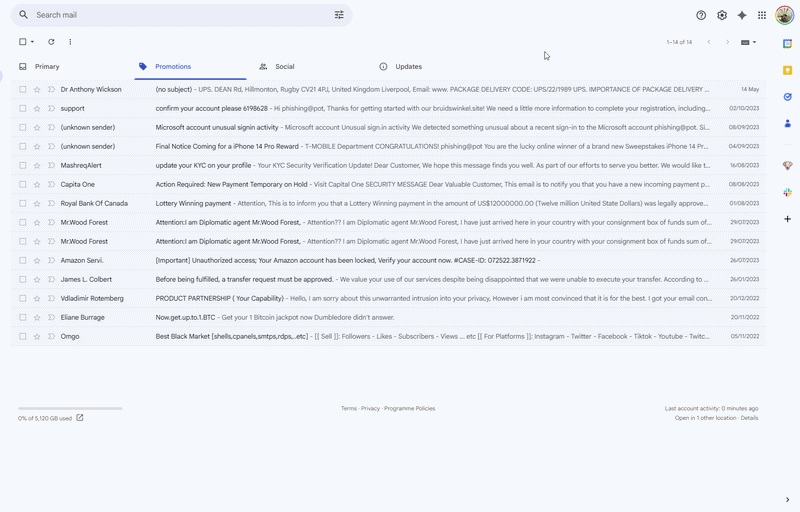

# UpDog - Phishing & Malware Scanner for Gmail

> **What's UpDog? Hopefully nothing, but let's make sure.**

UpDog is a Gmail Add-on that analyzes any open email and returns a maliciousness score from 0 (safe) to 100 (malicious), a plain-English verdict, and a list of what triggered it - so users know what to trust and why.

---

## What it does

When you open an email in Gmail, UpDog's sidebar card shows:

- A **risk score** with a color-coded verdict: Safe, Likely Safe, Suspicious, Likely Malicious, or Malicious
- A **findings list** explaining every signal that fired
- An **analyzer breakdown** showing how each layer contributed to the score
- A **breach alert** if the sender's domain was involved in a known data breach

---

## Demo

---

## Architecture

```
Gmail Add-on (Google Apps Script)
  └── POST /analyze  ──►  FastAPI backend (Python, GCP Cloud Run)
                               ├── analyzers/header.py
                               ├── analyzers/sender.py
                               ├── analyzers/url.py
                               ├── analyzers/content.py
                               └── analyzers/attachment.py
                          scorer.py  -  weighted combination + signal floors
  ◄── { score, verdict, color, bullets, breakdown }
```

The add-on fetches the raw email via the Gmail API and sends it to the backend as a single `raw_email` string. The backend runs the five analyzers in two parallel batches - headers/sender/URL/attachments first, then content (which depend on the first batch's results) - combines their scores, and returns a structured result. The add-on renders it - no logic lives in the frontend.

Three external services receive limited data during analysis: URLs from the email are sent to Google Safe Browsing (URLs may contain personal tokens such as user.id etc.), the sender's domain is sent to rdap.org and HaveIBeenPwned for domain age lookup and breach detection. 
If the user clicks "Check if I was exposed", their email address is sent to HaveIBeenPwned - this is explicit and user-initiated.

---

## Scoring system

Each analyzer returns a score from 0.0 to 1.0. The final score is a weighted combination:

| Analyzer    | Weight | Rationale |
|-------------|--------|-----------|
| URL         | 30%    | Google Safe Browsing api is the clearest signal |
| Sender      | 25%    | Brand impersonation and domain age are staples of phishing |
| Headers     | 20%    | SPF/DKIM/DMARC failures are strong - but misconfigured legitimate servers exist |
| Content     | 15%    | Keyword scoring is limited - a phisher can avoid trigger words |
| Attachments | 10%    | Risky extensions are meaningful but most legitimate email has attachments too |

URL and attachment weights are removed and redistributed when an email has no URLs or no attachments, so the score reflects what's actually present.

### Signal floors

In order to prevent diluting strong signals, I implemented a signal floor logic system - if a signal (or combination of signals) hits a threshold, the score is forced to at least a minimum value:

| Condition | Floor |
|-----------|-------|
| Known malicious URL | 95 |
| Risky attachment type | 80 |
| Clear brand impersonation or typosquatting | 85 |
| Sender score ≥ 70% | 55 |
| All three auth checks failed (SPF, DKIM, DMARC) | 60 |
| Two auth failures | 35 |
| One auth failure | 20 |
| Very high phishing keyword density | 70 |
| High phishing keyword density | 55 |
| Domain age unverifiable + any auth failure | 35 |
| Domain age unverifiable + no auth headers present | 25 |

### Score areas

| Score | Verdict | Color |
|-------|---------|-------|
| 0–14 | Safe | Green |
| 15–30 | Likely Safe | Light Green |
| 31–60 | Suspicious | Yellow |
| 61–80 | Likely Malicious | Orange |
| 81–100 | Malicious | Red |

---

## What each analyzer checks

### Email Headers
- SPF, DKIM, and DMARC pass/fail from the `Authentication-Results` header
- Counts explicit failures only - a missing header is not treated as a failure

### Sender
- **Display name spoofing** - "PayPal Support" sent from `evil.com`
- **Typosquatting** - Levenshtein distance against major brand domains (`paypa1.com`, `arnazon.com`)
- **Subdomain spoofing** - brand name embedded as a label (`paypal.evil.com`)
- **Domain age** - via RDAP; domains under 30 days score 1.0, under 90 days score 0.7
- **Suspicious domains** - domains using extensions like `.xyz`, `.click`, `.icu`, `.pw` and others disproportionately associated with phishing
- **Auth mitigation** - if all 3 Auth checks pass, subdomain spoofing and reply to mismatch are capped (likely a legitimate sending service like comeet)
- **HIBP breach check** - lookup against HaveIBeenPwned; informational only, no score impact

### URLs
- Extracts URLs from HTML 
- Removes Gmail redirects (`google.com/url?q=...`) before scanning (prevents checking the `google.com` url)
- Checks against Google Safe Browsing API (MALWARE, SOCIAL_ENGINEERING, UNWANTED_SOFTWARE, POTENTIALLY_HARMFUL_APPLICATION)
- Scores by threat type severity; returns the worst URL found

### Content
- Phishing keywords - we count keywords across categories (money, urgency, actions, account, authority, social, delivery) in English and Hebrew, then we normalize by total word count to avoid false positives on long legitimate emails
- HTML cloaking detection: invisible text (white-on-white, 0px fonts), base64 HTML data URIs, executable `<script>` tags, `javascript:` hrefs. Tiny fonts only count when combined with another technique
- Excessive all-caps detection
- Large money amounts
- Language detection - emails not in English or Hebrew get a minor score penalty; phishing keywords are matched in both languages

### Attachments
- Risky extension scoring (`.exe` → 1.0, `.ps1` → 0.8, `.docm` → 0.6, `.pdf` → 0.3, etc.)
- Password-protected archive detection (ZIP, RAR, 7z) - a common technique to bypass scanners
- MIME type / extension mismatch - a `.pdf` that is actually a ZIP is a red flag
- PDF active content detection - scans PDF bytes for `/Launch /JS /JavaScript`

### Forwarded emails
The scorer extracts the original `From:` address from forwarded message headers and runs a second sender analysis on it. 

---

## Security decisions

**No raw email logging** - No sensitive info is being stored anywhere.

**Token auth** - the backend requires an auth token on every request known only by the add-on. Without it, the endpoint rejects all traffic.

**CORS locked to `mail.google.com`** - the backend rejects requests from any other origin.

**All secrets in environment variables** - `API_TOKEN` and `SAFE_BROWSING_API_KEY` are never in source code.

**Untrusted input** - email content, URLs, and attachment bytes are all treated as hostile. BeautifulSoup parses HTML in isolation; archive inspection catches malformed files without crashing.

**No LLM layer** - sending raw email content (which may include private information) to an external AI API introduces a meaningful privacy risk.

---

## Running locally

### Backend

```bash
cd backend
pip install -r requirements.txt
```

Set environment variables:
```bash
export API_TOKEN=your-secret-token
export SAFE_BROWSING_API_KEY=your-google-api-key
```

Start the server:
```bash
uvicorn main:app --reload
```

The `/analyze` endpoint accepts:
```json
POST /analyze
Authorization: Bearer <token>
{ "raw_email": "<full RFC 822 email string>" }
```

### Add-on

Install [clasp](https://github.com/google/clasp):
```bash
npm install -g @google/clasp
clasp login
```

Deploy:
```bash
cd addon
clasp push
```

In the [Apps Script project settings](https://script.google.com), set Script Properties:
- `BACKEND_URL` - your deployed backend URL (e.g. `https://your-service.run.app`)
- `AUTH_TOKEN` - must match the backend's `API_TOKEN`

### Dev scoring tool

Score `.eml` files directly against the backend without deploying:
```bash
# single file
py tools/score_dev.py path/to/email.eml

# entire directory
py tools/score_dev.py path/to/emails/

# with full signal breakdown
py tools/score_dev.py path/to/email.eml --debug
```

---

## Deployment

The backend ships as a Docker container targeting GCP Cloud Run:

```bash
docker build -t updog .
docker tag updog gcr.io/<your-project>/updog
docker push gcr.io/<your-project>/updog
gcloud run deploy updog --image gcr.io/<your-project>/updog --set-env-vars API_TOKEN=...,SAFE_BROWSING_API_KEY=...
```

---

## Known limitations

- **Non-English phishing** - keyword scoring covers English and Hebrew. Phishing emails in other languages score lower on the content signal.
- **Image-only phishing** - emails that embed the malicious content entirely as an image bypass all text-based checks.
- **URL sandbox** - Safe Browsing catches known-bad URLs but it's a list, might miss newer URLs.
- **RDAP limitations** - RDAP misses some domains `.io .me .tv` etc. - we return a small score increase for RDAP misses. 

---

## Tech stack

| Layer | Technology |
|-------|-----------|
| Add-on | Google Apps Script (V8), CardService |
| Backend | Python 3.11, FastAPI, Uvicorn |
| Deployment | Docker, GCP Cloud Run |
| URL scanning | Google Safe Browsing API v4 |
| Domain age | RDAP (rdap.org) |
| Breach detection | HaveIBeenPwned API v3 |
| HTML parsing | BeautifulSoup4 |
| Archive inspection | zipfile, py7zr, rarfile |
| Language detection | langdetect |
